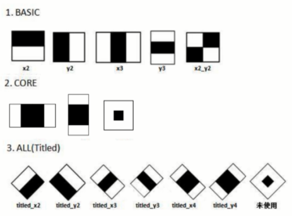

# 机器学习基础

M：机器学习和深度学习有什么不同呢？

Z：深度学习是实现机器学习的一种技术

- 机器学习：使用算法解析数据，对事件作出决策后和预测。
- 深度学习：利用人工神经网络和概率权重进行判断的学习过程，可以解决特征表达。

### 视频分解图片

M：机器学习需要很多的样本，怎么获取大量的样本呢？

Z：可以利用视频，分解成大量的图片，具体操作如下：

```python
import cv2 
cap = cv2.VideoCapture("1.mp4")  #载入视频
isOpened = cap.isOpened  #判断是否打开
# 获取帧数
fps = cap.get(cv2.CAP_PROP_FPS)
# 获取宽高
width = int(cap.get(cv2.CAP_PROP_FRAME_WIDTH))
height = int(cap.get(cv2.CAP_PROP_FRAME_HEIGHT))
print(fps,width,height)

i = 0
while(isOpened):
    if i == 10:
        break
    else:
        i = i+1
    (flag,frame) = cap.read() # 读取每一张
    fileName = 'image'+str(i)+'.jpg'
    print(fileName)
    if flag == True:
        cv2.imwrite(fileName,frame,[cv2.IMWRITE_JPEG_CHROMA_QUALITY,100])  #输出图片
print('end')
```

M：视频分解成了图片，那可以将图片合成视频吗？

Z：如下代码：

```python
import cv2
img = cv2.imread('image1.jpg') #读取第一张图片
imgInfo = img.shape  #获取图片信息
size = (imgInfo[1],imgInfo[0]) #获取图片大小信息
print(size)
videoWrite = cv2.VideoWriter('2.mp4',-1,5,size)  #定义视频对象 -1选择编码器，5 每秒钟5帧
for i in range(1,11):
    fileName = 'image'+str(i)+'.jpg'
    img = cv2.imread(fileName) #读取图片
    videoWrite.write(img) # 写入视频对象中
print('end')    
```

### Haar特征   

M：什么是Haar特征呢？

Z：特征是像素经过运算之后得到某个结果（可能是值，向量，多维，矩阵），OpenCV的Haar特征如下

  

Z：Haar特征就是某一处 特征模板像素 的四则运算，公式如下：

1. 特征 = 白色 - 黑色
2. 特征 = 整个区域 * 权重+黑色 * 权重
3. 特征 = (p1-p2-p3+p4)*w   

M：怎么计算整张图片的Haar特征呢？

Z：一个模板：遍历+缩放再遍历：

1. 用Haar模板从上到下，从左到右全部遍历一次。（像素，模板大小，步长）
2. 模板进行多次缩放之后（20次），再进行遍历。
3. 遍历完缩放之后，更换模板（14个）

M：这样计算Haar特征，1s需要计算1000亿次，对计算机要求太高。

Z：可以通过积分图极大减少运算量

### Haar+Adaboost实现人脸识别   

Z：具体代码如下：、

```python
import cv2 
import numpy as py
# 加载已训练好的xml分辨器
face_xml = cv2.CascadeClassifier('haarcascade_frontalface_default.xml')
eye_xml = cv2.CascadeClassifier('haarcascade_eye.xml')
# load jpg
img = cv2.imread('face.jpg')
cv2.imshow('src',img)
# 转化为灰度图片
gray = cv2.cvtColor(img,cv2.COLOR_BGR2GRAY)
faces = face_xml.detectMultiScale(gray,1.3,5)#灰度图片 缩放比例 识别对象最小像素
print('face',len(faces)) #打印人脸个数
# draw绘制人脸位置
for (x,y,w,h) in faces:  #遍历每张脸，获取其定点数据
    cv2.rectangle(img,(x,y),(x+w,y+h),(255,0,0),2) #在整张图片上定点画脸
    roi_face = gray[y:y+h,x:x+w]#获取解析后脸的数据
    roi_color = img[y:y+h,x:x+w]
    # 识别眼睛
    eyes = eye_xml.detectMultiScale(roi_face)#解析脸部的眼睛
    print('eye=',len(eyes))
    for (e_x,e_y,e_w,e_h) in eyes:
        cv2.rectangle(roi_color,(e_x,e_y),(e_x+e_w,e_y+e_h),(0,255,0),2)#画眼睛的位置
cv2.imshow('dst',img)

cv2.waitKey(0)
```


